# coerce-json

**Zero-dependency repair & schema coercion for LLM JSON — turn almost-valid model output into a value that fits your Zod (or JSON Schema) schema, with every fix logged.**

<p>
  <a href="https://www.npmjs.com/package/coerce-json"></a>
  <a href="https://github.com/H1manshu01/coerce-json/actions/workflows/ci.yml"></a>
  <a href="https://bundlephobia.com/package/coerce-json"></a>
  
  <a href="./LICENSE"></a>
</p>



An LLM asked for `{ id: number, active: boolean }` will hand you back
`{"id":"42","active":"true"}` wrapped in a ```` ```json ```` fence, with a stray
`"role"` it invented and a `status` of `"Activ"`. It's *almost* right — but
`schema.parse()` throws, and now you're writing one-off `if (typeof x === …)`
patches by hand. `coerce-json` does that repair for you, **reports every change
it made**, and never fabricates data the schema didn't ask for.

```ts
import { coerce } from "coerce-json";
import { z } from "zod";

const User = z.object({ id: z.number(), active: z.boolean(), role: z.string().default("user") });

const { value, ok, changes } = coerce('```json\n{"id":"42","active":"true"}\n```', User);
// value   → { id: 42, active: true, role: "user" }
// ok      → true
// changes → strip-fence, string->number @ id, string->boolean @ active, fill-default @ role
```

`ok` tells you whether it validated; `value` is the best-effort coerced result;
`changes` is an ordered, auditable log of every fix — so a coercion is never a
silent black box.

## Why another one?

LLMs return JSON that is *structurally* close but *type*-wrong: numbers as
strings, booleans as `"yes"`, an object wrapped in prose or a markdown fence, a
missing field that has a documented default. The existing tools each solve one
slice:

- `z.coerce` coerces primitives, but only the ones you wire up by hand, it can't
  strip a fence or pull JSON out of prose, and it tells you nothing about what it
  changed.
- `jsonrepair` / `json-repair` fix *syntax* (close braces, quote keys) but are
  schema-blind — they'll happily return `{"id":"42"}` because that's valid JSON.
- `instructor-js` re-prompts the model on a validation failure — a network round
  trip to fix a `"42"` that a local cast would have handled for free.

`coerce-json` is the one that is **schema-aware**, **reports every fix**, and
keeps lossy guesses **opt-in** — in one zero-dependency library.

| | coerce-json | `z.coerce` | `jsonrepair` / `json-repair` | `instructor-js` |
|---|:---:|:---:|:---:|:---:|
| Schema-aware type coercion | ✅ | ⚠️ manual | — | ✅ (via re-prompt) |
| Structural repair (fences / prose) | ✅ | — | ⚠️ syntax only | — |
| Reported change log | ✅ | — | — | — |
| Fuzzy enum / key re-casing | ✅ opt-in | — | — | — |
| Fills documented defaults | ✅ | ✅ | — | ✅ |
| Fixes offline (no re-prompt) | ✅ | ✅ | ✅ | — |
| Zero-dependency core | ✅ | — | ✅ | — |
| JSON Schema support | ✅ | — | n/a | ⚠️ partial |
| Typed (`z.infer`) | ✅ | ✅ | — | ✅ |

See [COMPETITORS.md](./COMPETITORS.md) for the full scan. Head-to-head numbers
are in [BENCHMARKS.md](./BENCHMARKS.md) — **re-run the harness yourself before
citing any number publicly.**

## Where it fits

`coerce-json` is the **repair + coerce** step of a streaming structured-output
pipeline, and the natural companion to
[`trickle-json`](https://www.npmjs.com/package/trickle-json) (same author):

```
fetch → SSE → parse partial JSON (trickle-json) → repair/coerce to schema (coerce-json) → validate
```

Provider-side strict schemas (OpenAI/Anthropic structured outputs) reduce the
need — but don't eliminate it. Local and open models, older endpoints, streamed
partials, and any output wrapped in prose or a fence still land almost-valid.
That's exactly `coerce-json`'s niche.

## Install

```sh
npm install coerce-json
```

Zero runtime dependencies. `zod` and `ajv` are **optional** peer dependencies —
install them only if you use the `coerce-json/zod` or Ajv-backed paths. Works on
Node ≥ 18 and Bun. Ships ESM + CJS + `.d.ts`.

## API

Three entry points. The root auto-detects your schema kind; the subpaths give
you tighter typing and validator-backed `ok`.

### `coerce-json` (root)

```ts
import {
  coerce,         // auto-detects Zod schema | JSON Schema | core Spec
  coerceToSpec,   // coerce against a raw core Spec
  isValid,        // dependency-free structural check against a Spec
  jsonSchemaToSpec,
  zodToSpec,
  isZodSchema,
} from "coerce-json";
import type {
  Spec, Change, ChangeType, CoerceOptions, CoerceResult, Json, JsonSchema, ZodLike,
} from "coerce-json";
```

- **`coerce(raw, schema, options?) → { value, ok, changes }`** — the one you
  reach for. `schema` can be a Zod schema (auto-detected, validated with its own
  `safeParse`), a JSON Schema object (validated with the built-in checker), or a
  core `Spec`.
- **`coerceToSpec(raw, spec, options?)`** — coerce directly against a normalized
  core `Spec`, no adapter.
- **`isValid(value, spec)`** — the dependency-free structural validator the core
  uses to compute `ok`.
- **`jsonSchemaToSpec(schema)` / `zodToSpec(schema)`** — the adapters, exposed so
  you can inspect or cache the translated `Spec`.
- **`isZodSchema(x)`** — structural Zod-schema check (never imports `zod`).

### `coerce-json/zod`

Fully typed via `z.infer`: when `ok` is `true`, `value` is typed as the schema's
**output** type.

```ts
import { coerce } from "coerce-json/zod";
import { z } from "zod";

const Schema = z.object({ n: z.number() });
const { value, ok, changes } = coerce('{"n":"7"}', Schema);
// value.n is typed `number`; ok → true; changes → [string->number @ n]
```

Also exports `zodToSpec`, `isZodSchema`, and the `ZodLike` type. `zod` is an
**optional peer dependency** — the core never imports it. The adapter reads a
schema's public structure (Zod v3 `_def`) to build a `Spec`, then calls the
schema's **own `safeParse`** for the authoritative `ok`, so refinements,
transforms, and pipelines are honored.

### `coerce-json/json-schema`

```ts
import { coerce, coerceWithAjv } from "coerce-json/json-schema";

const schema = {
  type: "object",
  properties: {
    id: { type: "integer" },
    active: { type: "boolean" },
    role: { type: "string", default: "user" },
  },
  required: ["id", "active"],
  additionalProperties: false,
} as const;

coerce('{"id":"5","active":"yes"}', schema);
// value → { id: 5, active: true, role: "user" }, ok → true
```

- **`coerce(raw, schema, options?)`** — `ok` via the built-in, dependency-free
  validator. Understands `type` (incl. `["string","null"]` → nullable), `enum`,
  `const`, `properties` / `required`, `additionalProperties` (false → strip
  extras; a value schema → record), `items`, `anyOf` / `oneOf`, and `default`.
- **`coerceWithAjv(raw, schema, ajvInstance, options?)`** — identical coercion,
  but `ok` comes from your Ajv instance for full draft-07 semantics. Ajv is an
  optional peer dependency you pass in; the library never imports it.

Also exports `jsonSchemaToSpec` and the `JsonSchema` / `AjvLike` types.

### Result shape

```ts
interface CoerceResult<T> {
  value: T;         // best-effort coerced value
  ok: boolean;      // did it validate after coercion?
  changes: Change[]; // ordered log of every fix
}

interface Change {
  path: (string | number)[]; // location within the value
  type: ChangeType;
  from?: unknown;
  to?: unknown;
  note?: string;
}
```

## Options

```ts
coerce(raw, schema, { fuzzy: true });
```

| Option | Default | What it does |
|---|---|---|
| `fuzzy` | `false` | Enable lossy, best-guess fixes: enum near-miss matching and object key re-casing. Off by default — these can change meaning. |
| `fuzzyEnumMaxDistance` | `2` | Max Levenshtein distance for a fuzzy enum match. |
| `fillDefaults` | `true` | Fill documented schema defaults for missing fields. |
| `unwrapText` | `true` | When the input is a string but the schema wants a structured value, strip markdown fences and extract JSON embedded in surrounding prose. |
| `maxDepth` | `100` | Recursion guard. |

> Enum **case-insensitive exact** matching (`"ACTIVE"` → `"active"`) is always on
> — it can't change meaning. Only enum **near-miss** (`"activ"` → `"active"`) and
> **key re-casing** (`first_name` → `firstName`) require `fuzzy: true`, and a
> fuzzy enum match that is ambiguous (ties between candidates) is refused.

## What gets fixed — every `ChangeType`

Each entry below is one possible value of `change.type`. Every mutation the
engine makes appears in `changes`; nothing is changed silently.

| `ChangeType` | Meaning |
|---|---|
| `strip-fence` | Removed a surrounding markdown code fence (```` ```json … ``` ```` or `` `…` ``). |
| `extract-json` | Pulled the first balanced JSON object/array out of surrounding prose. |
| `parse-json-string` | Parsed a raw JSON string into a structured value. |
| `trim` | Trimmed whitespace to match an enum value. |
| `string->number` | Cast a numeric string to a number. |
| `string->boolean` | Cast `true/false/yes/no/on/off/y/n/1/0` (case-insensitive) to a boolean. |
| `string->null` | Cast `"null"` / `"nil"` / `"none"` (case-insensitive) to `null`. |
| `number->string` | Stringified a number for a string field. |
| `boolean->string` | Stringified a boolean for a string field. |
| `empty->null` | Turned an empty string `""` into `null` for a nullable field. |
| `fill-default` | Filled a documented schema default for a missing field. |
| `enum-fuzzy` | Matched an enum value — case-insensitive exact (always on) or near-miss (`fuzzy`). `note` says which. |
| `key-casing` | Re-cased an object key to a schema field name (`fuzzy`, e.g. snake_case ↔ camelCase). |
| `strip-unknown-key` | Dropped a key not allowed under a strict (`additionalProperties: false`) object. |
| `drop-proto-key` | Dropped a dangerous `__proto__` / `constructor` / `prototype` key. |

## Guardrails

The point of a change log is trust. The engine holds four invariants, checked by
property tests:

- **Never fabricates data.** The only values it ever adds are **documented
  schema defaults**, and each fill is logged as `fill-default`. A missing
  optional field is left absent — never guessed.
- **Every mutation is logged.** `changes` is empty **if and only if** the output
  deep-equals the (parsed) input. If it changed something, it told you.
- **Idempotent.** Coercing an already-valid value produces zero changes, and
  re-coercing any output is a no-op — the engine reaches a fixpoint.
- **Prototype-pollution safe.** `__proto__`, `constructor`, and `prototype` keys
  are dropped from objects and records (logged as `drop-proto-key`), so a
  malicious payload can't walk up your prototype chain.

## Worked pipeline example

`coerce-json` is the repair step after a partial-JSON parser and before
validation. With [`trickle-json`](https://www.npmjs.com/package/trickle-json)
streaming the model's tokens and `coerce-json` fitting them to your schema:

```ts
import { StreamingJsonParser } from "trickle-json";
import { coerce } from "coerce-json/zod";
import { z } from "zod";

const Answer = z.object({
  sentiment: z.enum(["positive", "neutral", "negative"]),
  score: z.number(),
  tags: z.array(z.string()).default([]),
});

// 1. fetch → SSE → 2. parse partial JSON as it streams
const parser = new StreamingJsonParser();
parser.on("snapshot", (partial) => renderPreview(partial)); // progressive UI

const res = await fetch(endpoint, { /* ...stream: true */ });
for await (const chunk of res.body as any) parser.write(chunk);
const raw = parser.end(); // best-effort value from the stream

// 3. repair/coerce to the schema → 4. validate
const { value, ok, changes } = coerce(raw, Answer);
//   e.g. raw { sentiment: "Positive", score: "0.9" }
//   →   value { sentiment: "positive", score: 0.9, tags: [] }, ok: true
//   →   changes: enum-fuzzy @ sentiment (case-insensitive),
//                 string->number @ score, fill-default @ tags

if (ok) save(value);
else console.warn("could not fully repair:", changes);
```

`trickle-json` gives you the best value available on every chunk without
throwing; `coerce-json` makes that value fit your schema and hands you the
receipts.

## Development

```sh
npm install
npm test          # vitest (unit + property tests via fast-check)
npm run typecheck
npm run build     # tsup → ESM + CJS + .d.ts
npm run size      # size-limit (core, zero-dep)
npm run lint      # Biome
npm run bench     # correctness + coercion benchmark vs. incumbents
```

## License

MIT © Himanshu Sharma
